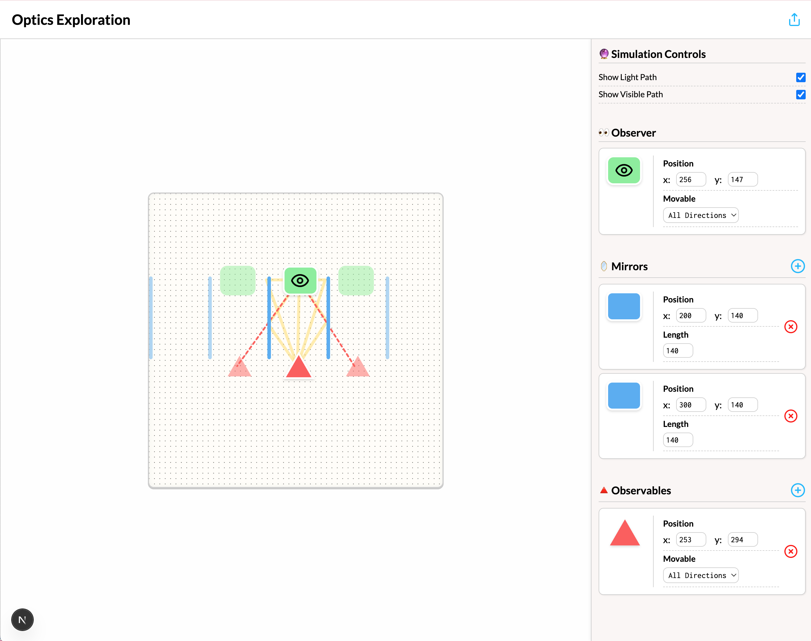

# Brilliant Optics Explorable

This is a self-contained explorable for playing with optics, specifically focusing on mirrors.

## Development

You will need nodejs + nextjs.

The easiest way to get started is to use the [Devenv](https://devenv.sh) config
files included in the project. You can get up and running almost instantly on
Github by using [Codespaces](https://github.com/features/codespaces).

### Code Space

- Click the Code button, wait for install
- run `yarn dev`
- You're up and running!

### Local Install

You will need

- node
- a node version compatiable with the one in `.nvmrc`
- yarn

To get started with this project:

- git clone `git@github.com:nicolecomputer/brilliant-optics-explorable.git`
- `cd brilliant-optics-explorable`
- `yarn install`
- `yarn dev`

## Deployment

This explorable deploys as a static site and is hosted on
[Cloudflare Pages](https://pages.cloudflare.com).

The domain,
[brilliant-optics-explorable.nicole.computer](https://brilliant-optics-explorable.nicole.computer/)
is hosted at [Hover](http://hover.com) with a CNAME record pointing to
brilliant-optics-explorable.pages.dev

## Usage

This project creates a lab component that is intended to be embedded as an iframe in content. This is similar to the approach that is used for embedding YouTube videos and Tweets.

This embedding feature is demoable by using the share function, when the share dialog is brough up a demo of an embed is shown as a preview.

## Changes

This project is not-open for changes. It was built as a practice/showoff and is not an ongoing project.
